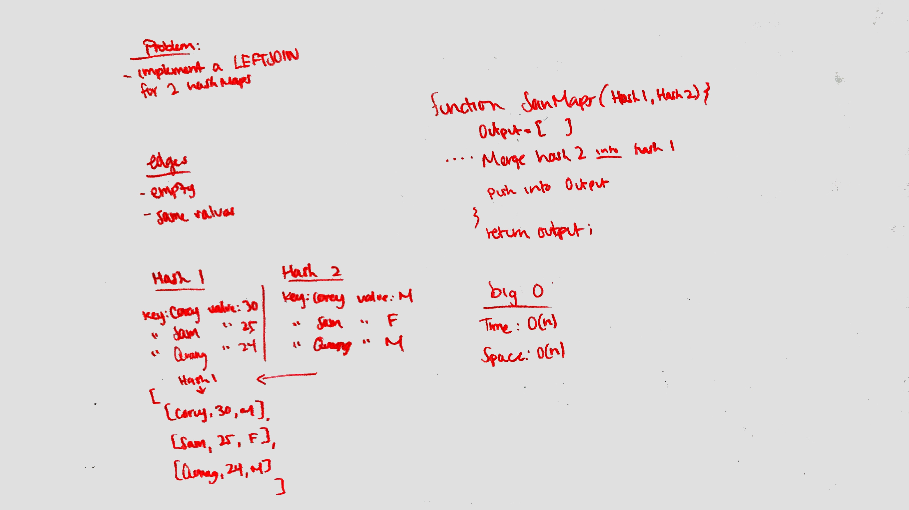

# left-join-hash-map

## challenge 
joining a hashmap into another hashmap using a left join

## approach
i want to create a function that takes in two parameters (hash1, hash2) and merge the left into the right. 
i would create an empty array and push the merge into it to create a new map.

## solution 

